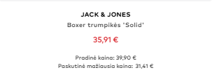

Pradėti rinkti spalvas bet spalvos pas mus bus aiškiai atskiriamos kaip Teal, Olive, Rust, copper ir panašiai...

Prėkių stebėjimas (paširdukinimas) - Toliau sekantis etapas bus telegram bot enpoint kad galetu pingint.

Noriu kad kainą kataloge rodytų taip: 

Filtravime &below_observed_30d=true, atsirastu logika kad ne tik musu duomenis naudotu bet ir galimybe persijungti į pateikiamą Šaltinio LPL:

Filtravimo zonos pakeitimas, kad kai paskaudi kitur arba ant kito filtro išsijungia paskesnis.

Tai po gi kategorijos, išskleista yra tik ta viena kurioje dabar esame, kitos visos tada buna suglaustos

Atsidarai megstukus, o dydžio filtras man rodo apie kelniu ilgi, Tokie filtrai turi buti dinaminiai ir keistis pagal informacija kokia yra dabar pateikiama kataloge

